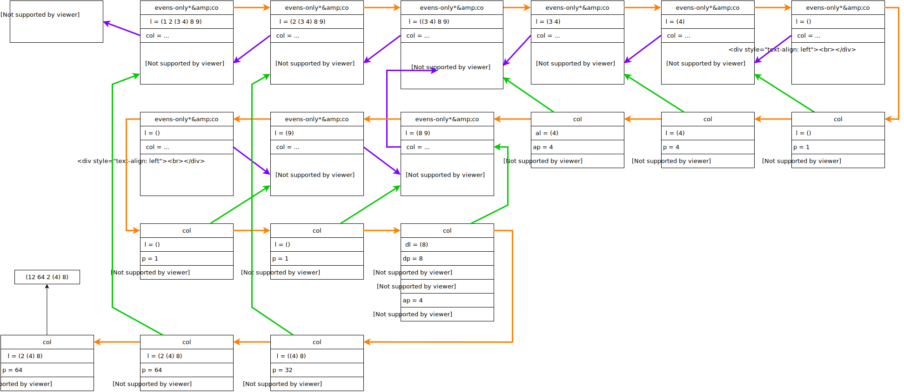

## Chapter 8: Lambda the Ultimate

## Conceptos

* **lambda**: función que recibe argumentos y retorna un elemento.
* **define**: le da un nombre a un lambda.
* Podemos enviar lambdas como argumentos.

## Funciones

### `rember-f test? a l` - first attempt

**Input data**:

* `test?`: función que recibe dos argumentos y retorna un valor de verdad.
* `a`: atom.
* `lat`: list of atoms.

**What to do**: construir una nueva lista que contenga todos los elementos de `l`, en su mismo orden, exceptuando aquellos para los cuales se cumpla la condición `test? (car l) a`.

**Analyzing the data**: la lista tiene átomos, y los compararemos con `a`. En cada recursión se trata a un átomo de `l`, y la recursión natural es sobre `cdr l`.

**What can happen**:

* `l` es null: retorno `'()`
* `l` no es null:
	* `test? (car l) a` es `#t`: recurro sobre `cdr l`
	* `test? (car l) a` es `#f`: agrego `car l` a la recursión sobre `cdr l`.

```
(define rember-f
	(lambda (test? a l)
		(cond
			((null? l) '())
			((test? (car l) a)
				(rember-f test? a (cdr l)))
			(else
				(cons (car l)
					(rember-f test? a (cdr l)))))))
```

### `rember-f test? s l` - second attempt

**Input data**:

* `test?`: función que recibe dos argumentos y retorna un valor de verdad.
* `s`: S-expression (o sea, un atom o una lista)
* `l`: list.

**What to do**: construir una nueva lista con las S-expressions de `l`, exceptuando aquellas para los que se cumpla que `test? (car l) s`.

**Implementation**: ¡es igual que `rember-f test? a l`! La función que se envíe a `test?` deberá lidiar con que los elementos sean atoms o S-expressions.

### `rember-f test?`

**Input data**: función `test?`.

**Output**: una función que recibe dos argumentos `a` y `l`. Podríamos decir que es `rember-f` pero con el argumento `test?` ya *incluído* (o sea, ya definido).

```
(define rember-f
	(lambda (test?)
		(lambda (a l)
			(cond
				((null? l) '())
				((test? (car l) a)
					(rember-f test? a (cdr l)))
				(else
					(cons (car l)
						(rember-f test? a (cdr l)))))))
```

### `insert-g` - first attempt

**Input data**:

* `test?`
* `seq`: función que toma dos elementos y una lista, y agrega los elementos a la lista en un cierto orden.
* `new`
* `old`
* `l`

**Output**: lista igual a `l` con la diferencia de que antes o después (dependiendo de la función `seq` recibida) de cada `old` estará la S-expression `new`.

**The data**: en cada recursión tendremos a `car l` como el elemento a analizar. Puede pasar que:

* `test? (car l) old` sea `#t`: agrego los elementos a la lista usando `seq` y a la vez recurro con `cdr l`: `seq new old (insert-g test? seq new old (cdr l))`
* `test? (car l) old` sea `#f`: agrego `car l` a la recursión con `cdr l`.
* Cuando `l` sea null retornaremos `()`, ya que estábamos construyendo una lista.

```
(define insert-g
	(lambda (test? seq new old l)
		(cond
			((null? l) '())
			((test? (car l) old)
				(seq new old (insert-g test? seq new old (cdr l)))
			(else
				(cons (car l) (insert-g test? seq new old (cdr l))))))
```

### `insert-g` - second attempt

**Input data**: `seq`, función que recibe como argumento dos S-expressions y una lista.

**Output**: función como la revisión anterior de `insert-g` pero que no recibe a `seq` como argumento, ya que queda *definido* dentro de la función actual.

```
(define insert-g
	(lambda (seq)
		(lambda (test? new old l)
			(cond
				((null? l) '())
				((test? (car l) old)
					(seq new old (insert-g test? seq new old (cdr l)))
				(else
					(cons (car l) (insert-g test? seq new old (cdr l))))))
```

Ejemplo: `(define insert-l (insert-g seq-l))`.

### `insert-g` - un nivel más

```
(define insert-g
	(lambda (seq)
		(lambda (test?
			(lambda (new old l)
				(cond
					((null? l) '())
					((test? (car l) old)
						(seq new old (insert-g test? seq new old (cdr l)))
					(else
						(cons (car l) (insert-g test? seq new old (cdr l))))))

```

Luego usaríamos:

```
(define insert-l-equal? ((insert-g seq-l) equal?))
(insert-l-equal new old l)
```

### The Ninth Commandment

> Abstract common patterns with a new function

Para tener en cuenta, algo muy interesante que vimos hasta acá es la aplicación del *currying*.

### `value nexp`

**Input data**: numbered S-expression `nexp`.

**Output**: valor numérico.

**Data**: `nexp` puede ser un atom o puede contener una operación y dos subexpresiones.

* `nexp` es un atom: retornar atom.
* `nexp` no es atom: determinar la operación en `nexp` y aplicarla a sus subexpresiones. Steps:
	* `(op nexp)`: nos dará el atom correspondiente al operator de `nexp`.
	* `(x+↑-to-function (op nexp))`: nos dará la función correspondiente al operator de `nexp`.
	* `((x+↑-to-function (op nexp)) (subexp1 nexp) (subexp2 nexp))`: aplicación de la operación sobre las subexpresiones de `nexp`.

```
(define value
	(lambda (nexp)
		(cond
			((atom? nexp) nexp)
			(else
				((x+↑-to-function (op nexp))
					(value (subexp1 nexp))
					(value (subexp2 nexp)))))))
```

###### Helpers

`x+↑-to-function a`: recibe un atom `a` que será `'x`, `'+` o `'↑` y devuelve la correspondiente función:

```
(define x+↑-to-function
	(lambda (a)
		(cond
			((eq? a 'x) x)
			((eq? a '+) +)
			(else ↑))))
```

`op aexp`: retorna el operador de `nexp`.

*How*: `aexp` es una lista en la que el primer elemento es el operador.

```
(define op
	(lambda (aexp)
		(car aexp)))
```

`subexp1 aexp`: `aexp` es una lista en la que el segundo elemento es una expresión numérica.

```
(define subexp1
	(lambda (aexp)
		(car (cdr aexp))))
```

`subexp2 aexp`: `aexp` es una lista en la que el tercer elemento es una expresión numérica.

```
(define subexp2
	(lambda (aexp)
		(car (cdr (cdr aexp)))))
```

### `multirember&co`

```
(define multirember&co
	(lambda (a lat col)
		(cond
			((null? lat)
				(col '() '()))
			((eq? (car lat) a)
				(multirember&co a (cdr lat)
					(lambda (newlat seen)
						(col newlat (cons (car lat) seen)))))
			(else
				(multirember&co a (cdr lat)
					(lambda (newlat seen)
						(col (cons (car lat) newlat) seen)))))))
```

###### Case 1

```
(define a-friend
	(lambda (x y)
		(null? y)))
```

```
multirember&co
	a = 'tuna
	lat = '()
	col = a-friend
lat is null -> a-friend '() '() -> #t
```

###### Case 2

```
multirember&co
	a = 'tuna
	lat = '(tuna)
	col = a-friend
eq? (car lat) a ->
	multirember&co
		a = 'tuna
		lat = '()
		col =
			(lambda (newlat seen)
				(a-friend newlat (cons 'tuna seen)))
```

```
1.
multirember&co
	a = 'tuna
	lat = '(tuna)
	col = a-friend
eq? (car lat) a ->

2.
multirember&co
	a = 'tuna
	lat = '()
	col =
		(lambda (newlat seen)
			(a-friend newlat (cons 'tuna seen)))
null? lat -> col '() '()

3.
col
	newlat = '()
	seen = '()
a-friend '() '(tuna)

4.
a-friend
	x = '()
	y = '(tuna)
null? y -> #f

3.
a-friend '() '(tuna) -> #f

2.
col '() '() -> #f

1.
multirember&co 'tuna '(tuna) a-friend -> #f
```

##### Conclusiones

En cada recursión se genera una función `col` que:

* recibe dos listas como argumento;
* conoce/captura dos valores: un atom (`car lat`) y la función conocida como `col` (que había sido recibida por `multirember&co` de su recursión anterior);
* invoca a la función enviándole las listas, agregando `car lat` a una de ellas, según la condición cumplida.

Esta función se envía a la siguiente recursión (hacia adelante). Al llegar al final de la lista, se invoca a la función `col` recibida. Se genera una cadena de llamados en la que cada `col` invoca a su `col` anterior agregando información a una de las dos listas.

Cuestión:

* a la ida se determina lo que se construirá mediante lambdas que se van pasando como argumento;
* a la vuelta se efectúa la construcción mediante la invocación de las lambdas.

*Nota*: la cadena de *construcción* se da a partir de que las *lambdas* están entrelazadas unas con otras: una *lambda* definida en el paso **k** de la recursión invocará a la *lambda* definida en el paso **k - 1**.

### `multiinsertLR`

**Input**: `new oldL oldR lat`

**Preconditions**: `oldL` y `oldR` son diferentes

**What to do**: agregar `new` a la izquierda de cada ocurrencia de `oldL` y a la derecha de cada ocurrencia de `oldR`.

### `evens-only*`

**Input**: `l`

**To do**: construir una nueva lista sin las apariciones de los números pares.

**How to**: en cada vuelta tengo `l` y pretendo analizar su primer elemento `car lat`; puede pasar que:

* `l` es null: retorno `'()`
* `car l` es un atom:
	* `car l` es impar: recurro hacia adelante
	* `car l` es par: agrego `car l` al resultado de recurrir hacia adelante
* `car l` es una lista: agrego el resultado de recurrir hacia abajo al resultado de recurrir hacia adelante

```
(define evens-only*
	(lambda (l)
		(cond
			((null? l) '())
			(atom? (car l)
				(cond
					((even? (car l))
						(cons (car l) (evens-only* (cdr l))))
					(else
						(evens-only* (cdr l))))
			(else
				(cons (evens-only* (car l)) (evens-only* (cdr l)))))))
```

### `evens-only*&co`

**Input**: `l col`

**What to do**: generar una lista y dos números. La lista consiste en los números pares de `l`; el primer número consiste en la multiplicación de todos los pares, y el segundo número es la suma de todos los impares.

**Structure**:

```
(define evens-only*&co
	(lambda (l col)
		(cond
			((null? l)
				;; valores iniciales para los datos de salida
				(col '() 1 0))
			(atom? (car l)
				(cond
					((even? (car l))
						(evens-only* (cdr l)
							;; genero una función que al ser invocada
							;; agregará a `car l` a la lista y a la cadena
							;; de multiplicaciones
						))
					(else
						(evens-only* (cdr l)
							;; genero una función que al ser invocada
							;; agregará a `car l` a la cadena de sumas
						)))
			(else
				(evens-only* (car l)) 
							;; ???
				)))))
```

**Code** - first attempt:

```
(define evens-only*&co
	(lambda (l col)
		(cond
			((null? l)
				(col '() 1 0))
			(atom? (car l)
				(cond
					((even? (car l))
						(evens-only* (cdr l)
							(lambda (l p s)
								(col (cons (car l) l) (x (car l) p) s))))
					(else
						(evens-only* (cdr l)
							(lambda (l p s)
								(col l p (+ (car l) s)))))))
			(else
				(evens-only* (car l)) 
							;; ???
				)))))
```

*Nota*: dentro de los *lambdas*, la invocación a `col` representa la continuación hacia *atrás* (recursión **k** hacia **k - 1**) en esta cadena de construcción de los datos.

**¿Qué pasa cuando `car l` es una lista?**

Cuando `car l` es un atom, construyo una función en la que modifico ciertos datos: a algunos los conozco ahora, a otros los recibirá luego como parámetro. Recurro naturalmente y envío esta función, que será llamada cuando corresponda. ¡Un lujo!

Ahora bien, cuando `car l` es una lista, genero una función que va a recurrir naturalmente, y recurro sobre `car l` enviándole esa función. **KHÉ**. Anteriormente, cuando todo era más simple, al momento de tener que recurrir hacia abajo y hacia adelante, hacíamos algo así como `(and (recur (car l)) (recur (cdr l)))`. Lo que hacíamos era aplicar la operación de *construcción* del valor final sobre el resultado de recurrir hacia abajo y hacia adelante. Ahora, recurrimos hacia abajo e indicamos que, al finalizar, continúe con la recursión hacia adelante.

En este caso, el código correspondiente a que `car l` sea una lista es:

```
(evens-only*&co
	(car l)
	(lambda (al ap as)
		(evens-only*&co
			(cdr l)
			(lambda (dl dp ds)
				(col
					(cons al dl)
					(x ap dp)
					(+ as ds))))))
```

*¿Qué significa todo este código?*

```
(evens-only*&co (car l) fun)
```

Recurro sobre `car l`. `fun` es la función que será llamada cuando

* se haya recurrido hasta el final de `car l`, y entonces
* se tengan los valores *construidos*.

`fun` recibirá en `al ap as` los valores resultantes de efectuar `(evens-only*&co (car l))`, y con ellos podrá hacer lo que quiera.

En este caso, lo que queremos que haga es recurrir sobre `cdr l`:

```
(evens-only*&co (cdr l) fun)
```

Aquí `fun` es la función que será llamada cuando

* se haya recurrido hasta el final de `cdr l`, y entonces
* se tengan los valores *construidos*.

Suena conocido. *Es* conocido: `fun`, o `col` si lo vemos desde el otro lado, es la función que será invocada cuando se haya recurrido hasta el final sobre `car l`/`cdr l` y se haya avanzado en la *construcción* de los valores finales hasta tener los correspondientes a `evens-only*&co (car l)/(cdr l)`. Cuestión, lo que yo debo definir en `fun` es **qué quiero hacer con el resultado de la recursión**. Aparentemente, es lo mismo que hacíamos antes, lo que pasó es que la necesidad de *construir* más de un dato nos llevó a tener que implementar la idea de una forma distinta. Esta forma es crear una función que:

* recibirá como argumentos los valores resultantes de la recursión, y
* efectuará lo que sea que queramos hacer con los resultados.

Un detalle interesante es que aquellos valores que sean conocidos, por ejemplo el atom `car l`, podrán ser utilizados.

Volviendo al código que nos compete:

```
(evens-only*&co ;; 1
	(car l)
	(lambda (al ap as) ;; 2
		(evens-only*&co ;; 3
			(cdr l)
			(lambda (dl dp ds) ;; 4
				(col ;; 5
					(cons al dl) ;; 5
					(x ap dp) ;; 5
					(+ as ds)))))) ;; 5
```

Lo que hago es:

1. recurrir sobre `car l`
2. definir la función que recibirá los resultados de dicha recursión, y pasarla como argumento a la recursión
3. en esa función, recurrir sobre `cdr l`
4. definir la función que recibirá los resultados de dicha recursión, y pasarla como argumento a la recursión
5. en esa función, efectuar mi parte de la construcción sobre los datos resultado, y pasar estos datos a una función `col` (cuando me invocaron me pasaron esa función, con lo que tácitamente me indicaron que yo debía, al obtener mis resultados, invocarla y pasárselos)

A continuación un diagrama sobre lo que generaría la ejecución de

```
(evens-only*&co
	(1 2 (3 4) 8 9)
	(lambda (l p s)
		(cons s (cons p l))))
```

mostrando resultados finales e intermedios.



*Referencias*

* Las flechas *naranjas* conectan los recuadros con nombres de funciones, y representan la invocación de una función por parte de la otra.
* Las flechas *rojas* que conectan a recuadros `col` con *lambdas*, muestran que dicha `col` consiste en dicha *lambda*.
* Las flechas *verdes* que conectan recuadros de funciones `col` con *lambdas*, muestran que esa `col` consiste en dicha *lambda*; es decir, que el código de la `col` es esa *lambda*.

### `multirember*&co`

Y ahora, para mi propio deleite, vamos a diseñar la función `multirember*&co a l col` que eliminará todas las ocurrencias de `a` en `l` y retornará un *pair* consistente de la lista resultante, y la cantidad de `a` que fueron eliminados.

##### Input

* `a`: atom
* `l`: lista vacía o lista de S-expressions
* `col`: lambda a la que se le enviarán los resultados obtenidos

##### What to do

Eliminar todas las ocurrencias de `a` en `l`, generando una nueva lista y contando la cantidad de ocurrencias eliminadas.

##### How to

En cada recursión, tendremos una lista `l`. Qué puede pasar:

* `l` es null: terminé alguna recursión; invoco a la función `col` que me enviaron, indicando los resultados iniciales: `'()` y `0`.
* `car l` es un atom: debo analizarlo y recurrir hacia adelante:
	* `car l` es igual a `a`: recurro sobre `cdr l` enviando un lambda que reciba dos argumentos (una lista y un número) y los envíe a `col` incrementando al número en 1. Estos argumentos consistirán en los resultados de la recursión.
	* `car l` es distinto de `a`: recurro sobre `cdr l` enviando un lambda que reciba dos argumentos (una lista y un número) y los envíe a `col` agregando a `car l` a la lista. Estos argumentos consistirán en los resultados de la recursión.
* `car l` es una lista: debo recurrir hacia abajo y hacia adelante y combinar los valores resultantes.
	* Recurro sobre `car l` enviando un lambda que reciba dos argumentos (una lista y un número).
		* Estos argumentos consistirán en los resultados de la recursión sobre `car l`.
		* Dentro del lambda, recurro sobre `cdr l` enviando otro lambda que reciba dos argumentos (una lista y un número).
			* Estos argumentos consistirán en los resultados de la recursión sobre `cdr l`.
			* Dentro del lambda, invoco a `col` y le envío la *construcción* de los datos obtenidos de las recursiones.

##### Code

```
(define multirember*&co
	(lambda (a l col)
		(cond
			((null? l)
				(col '() 0))
			((atom? (car l))
				(cond
					((eq? (car l) a)
						(multirember*&co a (cdr l)
							(lambda (l n)
								(col l (add1 n)))))
					(else
						(multirember*&co a (cdr l)
							(lambda (l n)
								(col (cons (car l) l) n)))))
			(else
				(multirember*&co a (car l)
					(lambda (al an) ;; [1]
						(multirember*&co a (cdr l)
							(lambda (dl dn) ;; [2]
								(col (cons al dl) (+ an dn)))))))))) ;; [3]
```

[1]: lo que quiero hacer con el resultado de la recursión sobre `car l`

[2]: lo que quiero hacer con el resultado de la recursión sobre `cdr l`

Es re loco porque [1] se lanza cuando se obtienen los resultados de la recursión de `car l`, y [2] se lanza cuando se obtienen los resultados de la recursión sobre `cdr l`. Y, como [2] se define en un contexto en ejecución en el que **ya se conocen los resultados de la recursión sobre `car l`**, en [2] se conocen ambos resultados. Por eso es que en [2] yo los manipulo como quiero. **Fa**.

[3]: ¿Por qué `cons al dl` y no `cons dl al`? En este punto, estamos construyendo la lista resultante de eliminar las apariciones de `a`. Ya recurrimos sobre `car l` y sobre `cdr l`, ahora falta unirlos. El orden original de la lista es `cons (car l (cdr l))`, y es lo que nosotros debemos construir: la *misma* lista eliminando ciertos elementos. Por ejemplo:

```
l: ((1 2) 3 2)
a: 2
al: (1)
dl: (3)
```

Para obtener la *misma* lista, debo *consear* `al` a `dl`: `((1) 3)`.